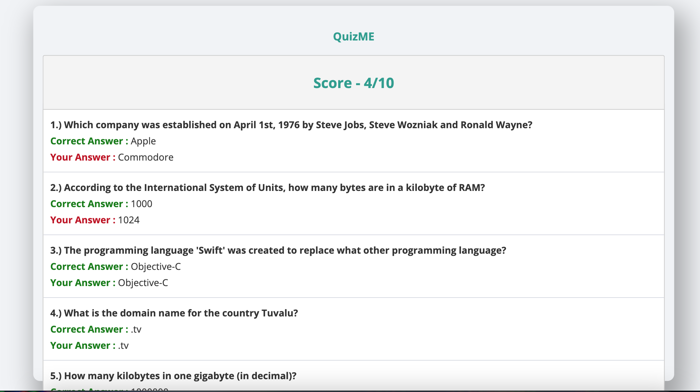

# Quiz Application

# Description of project
This web application is a quiz game to test users knowledge on a topic they select. The project is developed with the Angular framework. The range of topics include:
- movies
- technology
- sports
- history
- politics
- mathematics

The user can also select the level of difficulty ranging from
 - easy
 - medium 
 - hard.

In order to start the quiz, the user must also input their username of choosing. 

# How to install, run and build the project

This project was generated with [Angular CLI](https://github.com/angular/angular-cli) version 8.3.8.

## Development server - If you would like to contribute

Run `ng serve` for a dev server. Navigate to `http://localhost:4200/`. The app will automatically reload if you change any of the source files.

## Code scaffolding 

Run `ng generate component component-name` to generate a new component. You can also use `ng generate directive|pipe|service|class|guard|interface|enum|module`.

## Build 

Run `ng build` to build the project. The build artifacts will be stored in the `dist/` directory. Use the `--prod` flag for a production build.

# Demonstration of Quiz 

# File Organization

The bulk of the code in this project is within the src folder. In the src folder there is an app folder, assets folder, and environments folder. As a contributor, the app folder would be most useful. The app folder contains all the files for the quiz, result, and welcome pages which are the three main portions of the project.  Each quiz, results, and welcome folders consist of Angular (typescript), html, and css code that encompases the full stack web application

# Technologies - what they do and why they are used

### Angular
<a href="https://angular.io/tutorial" target="_blank">Angular Website</a>

Angular is an open-source web application framework maintained by Google, designed for building single-page applications (SPAs) with features like two-way data binding, component-based architecture, and robust tooling. It's suited for scalable, enterprise-level applications due to its modularity, TypeScript integration, and comprehensive solutions for common web development challenges. However, for smaller projects or simple websites, other frameworks or tools might be more appropriate.

### HTML and CSS
<a href="https://developer.mozilla.org/en-US/docs/Web/HTML" target="_blank">HTML Website</a>
<a href="https://developer.mozilla.org/en-US/docs/Web/CSS" target="_blank">CSS Website</a>

HTML (HyperText Markup Language) is the standard markup language used to create and design the structure of web pages, defining elements such as headings, paragraphs, and links. CSS (Cascading Style Sheets) complements HTML by providing the means to style and layout web content, allowing designers to specify colors, fonts, spacing, and responsive designs. Together, HTML provides the foundational structure of a webpage, while CSS brings it to life with aesthetics and visual design.

# Testing

## Running unit tests

Run `ng test` to execute the unit tests via [Karma](https://karma-runner.github.io).

## Running end-to-end tests

Run `ng e2e` to execute the end-to-end tests via [Protractor](http://www.protractortest.org/).

## Further help

To get more help on the Angular CLI use `ng help` or go check out the [Angular CLI README](https://github.com/angular/angular-cli/blob/master/README.md).

# Contributing
Contributions are accepted via pull requests. You can also open issues on bugs, typos or any corrections and suggest improvements on the notebooks and other contents.

# Check out the website here!

[CHECK HERE! :arrow_right: ](https://suspicious-keller-513235.netlify.app/) 

